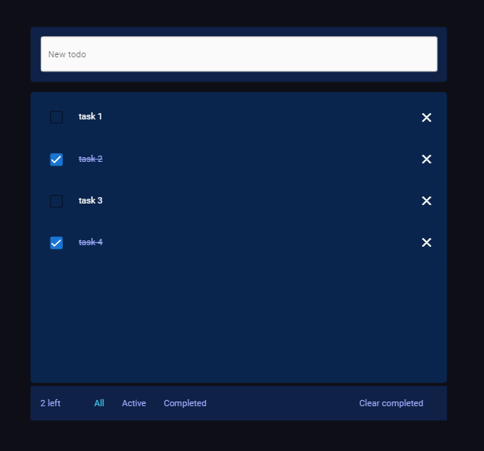

# Vue 3 ToDo list

This is a simple ToDo list made with Vue 3 (composition API) and Vuex 4

## Installation

Just clone this repo and install packages with  `npm` or `yarn`

```bash
$ npm install
```

## Run the app

You can run in development mode using:

```bash
$ npm run dev
```

Or build with:

```bash
$ npm run build
```

And after use:

```bash
$ npm start
```

## App screen


